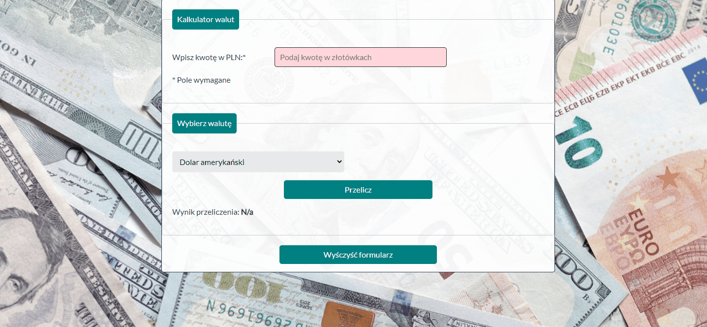

# Currency-Converter
It is a simple calculator with which you can easily convert several currencies.

## Screenshots
How it works

## First page
The technologies used in my project, thanks to participation in the YouCode programming course are: 
- HTML
- CSS
- JavaScript ES6+
- BEM 
- Normalize
- Markdown
- GIT

## Demo
https://lukaszdabros.github.io/currency-converter/
